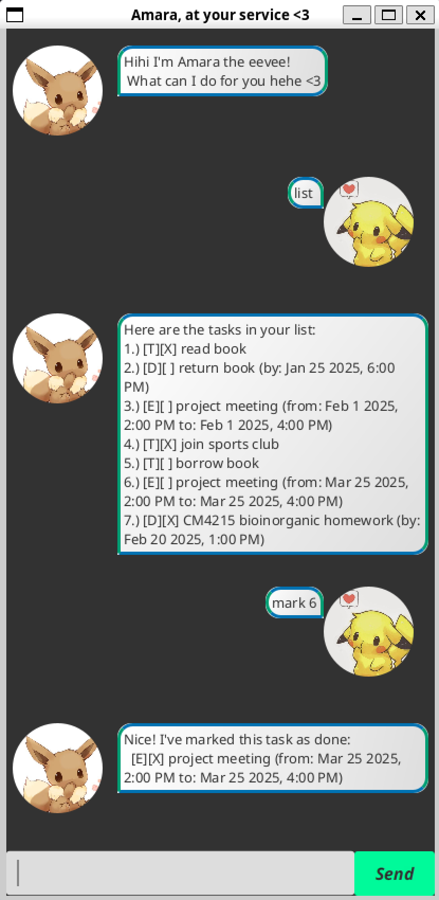

# Amara User Guide <3



Amara the Eevee✨ is here to help you! She is a minimalistic command line task manager that 
has a simple to use graphical user interface that allows users to organize *todo*, *deadline* 
and *event* tasks. More functionalities such `list`, `mark`, `unmark`, `delete`, `find`, `sort`
allow users to check off tasks list and easily find their tasks in a quick and neat manner!
More importantly, your task list persists throughout each sessions!

## Viewing help: `help`
Shows the full list of Command that Amara the Eevee✨ can do for your task list.

## Exiting the program: `bye`
Exits the program

> [!Note]
> - Changes to the task list are automatically saved and loaded after each command! Accidentally exiting the program will not result in data loss.

## Adding todo task: `todo descrption`
Amara bot will add a uncompleted To Do task to the back of the task list. 
```
>> todo CM3221 Disconnection Approach Homework
Got it. I've added this task:
  [T][] CM3221 Disconnection Approach Homework
Now you have x tasks in your list.
```
> [!Important]
> - ToDo Task Description cannot be empty.

## Adding deadline task: `deadline description /by datetime`
Amara bot will add a uncompleted Deadline task to the back of the task list. 
```
>> deadline CM4215 Bioinorganic Chemistry Tutorial /by 2025-02-20 1300
Got it. I've added this task:
  [D][] CM4215 Bioinorganic Chemistry Tutorial (by: Feb 20 2025, 1:00pm)
Now you have x tasks in your list.
```
> [!Important]
> Deadline Task Description cannot be empty.\
> Datetime format: `YYYY-MM-DD HHMM`
>

## Adding event task: `event descrption /from datetime /to datetime`
Amara bot will add a uncompleted To Do task to the back of the task list.
```
>> event CM4288 project meeting /from 2025-02-19 1500 /to 2025-02-19 1600
Got it. I've added this task:
  [E][] CM4288 project meeting (from: Feb 19 2025, 3:00pm to: Feb 19 2025, 4:00pm)
Now you have x tasks in your list.
```
> [!Important]
> - Event Task Description cannot be empty.\
> - Datetime format: `YYYY-MM-DD HHMM`

## listing all tasks: `list`
Amara bot collects all of the tasks and displays them in a orderly fashion 
```
>> list
Here are the tasks in your list:
1.) [T][] CM3221 Disconnection Approach Homework
2.) [D][] CM4215 Bioinorganic Chemistry Tutorial (by: Feb 20 2025, 1:00pm)
3.) [E][] CM4288 project meeting (from: Feb 19 2025, 3:00pm to: Feb 19 2025, 4:00pm)
```
> [!Note]
> - Tasks are displayed in the order they were added.

## Marking a task as done: `mark index`
Amara bot will mark a task as completed based on its index in the list.
```
>> mark 1
Nice! I've marked this task as done:
  [T][X] CM3221 Disconnection Approach Homework
```
> [!Important]
> - Task number must be a valid number within the list.

## Unmarking a task: `unmark index`
Amara bot will unmark a task, setting it back to incomplete.
```
>> unmark 1
OK, I've marked this task as not done yet:
  [T][] CM3221 Disconnection Approach Homework
```
> [!Important]
> Task number must be a valid number within the list.

## Deleting a task: `delete index`
Amara bot will remove a task from the list based on its task number.
```
>> delete 2
Noted. I've removed this task:
  [D][] CM4215 Bioinorganic Chemistry Tutorial (by: Feb 20 2025, 1:00pm)
Now you have x tasks in your list.
```

## Finding a task: `find keyword`
Amara bot will search for tasks containing the specified keyword.
```
>> find Chemistry
Here are the matching tasks in your list:
1. [D][] CM4215 Bioinorganic Chemistry Tutorial (by: Feb 20 2025, 1:00pm)
```
> [!Note]
> - Search is case-insensitive.

## Sorting the task list: `sort`
Amara bot will sort the task list based on the following comparisons
1. Sort all task into their individual categories (ToDo, Event and Deadline).
2. Sort `Deadline` and `Event` task based on their due date and start timing.
3.  Sort the events by their description lexicographically.
```
>> list
Here are the tasks in your list:
1.) [T][X] read book  
2.) [D][ ] return book (by: Jan 25 2025, 6:00 PM)  
3.) [E][ ] project meeting (from: Feb 1 2025, 2:00 PM to: Feb 1 2025, 4:00 PM)  
4.) [T][X] join sports club  
5.) [T][ ] borrow book  
6.) [E][X] project meeting (from: Mar 25 2025, 2:00 PM to: Mar 25 2025, 4:00 PM)  
>> sort 
Here is your sorted task list based on type!
1.) [T][ ] borrow book  
2.) [T][X] join sports club  
3.) [T][X] read book  
4.) [D][ ] return book (by: Jan 25 2025, 6:00 PM)  
5.) [E][ ] project meeting (from: Feb 1 2025, 2:00 PM to: Feb 1 2025, 4:00 PM)  
6.) [E][X] project meeting (from: Mar 25 2025, 2:00 PM to: Mar 25 2025, 4:00 PM) 
```
> [!Note]
> - When sorting by type, ToDo tasks appear first, followed by Deadlines, then Events. \
> - When sorting by date, tasks are ordered from the earliest due/start time to the latest.
